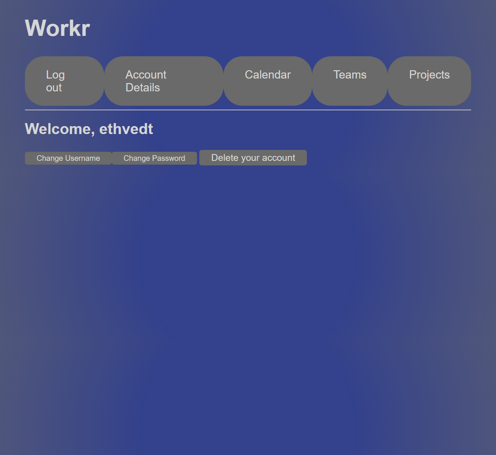

# Workr

A simple productivity web app that allows multiple users to work together on shared projects. Create teams, add users to teams and projects, keep track of everyone's tasks, and view your own tasks either in a calendar view or broken down by project.

## Libraries and Packages Used

### Frontend

- React
- React-dom
- React-router-dom
- React-markdown
- React-scripts
- React-select
- React-calendar
- React-datepicker
- React-beautiful-dnd
- Recoil
- Formik
- Yup

### Backend

- Flask
- Flask-SQLAlchemy
- Flask-migrate
- SQLAlchemy-serializer
- Flask-RESTful
- Flask-CORS
- Flask-BCrypt
- Faker

## Video Walkthrough

https://www.loom.com/share/44d8291d1e9a4240aa465b85379444c3?sid=131d8662-97ab-452f-a947-43a64ffa0833

## Walkthrough

### Login

You can log in or create a new account here.

Change account details or delete your account. This will delete all tasks associated with this account and remove it from all teams and projects.

### Calendar

All of your tasks are laid out on the calendar by due date, so you can prioritize your time and work on what needs to be done.

### Teams

You can view every team you are a part of here. You can also create new teams, and depending on your role in a team, you can add and remove users, or delete the team entirely.

### Projects

This is a list of every project you are a part of. You can see what task is next due for you for each project, and you can create new projects and assign them to a team. You can also see a detailed view of any project by clicking View Details.

In the project details page, you have access to a kanban board with full drag-and-drop functionality, allowing you to create new tasks and update their statuses on the fly. Team members are added to projects automatically on creation of the project, but you can also manually add other users that are not part of the team associate with the project. 